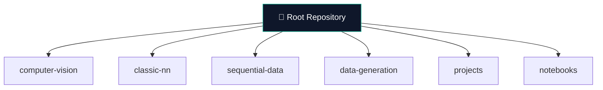

<br>

**\[[🇧🇷 Português](README.pt_BR.md)\] \[**[🇺🇸 English](README.md)**\]**

<br><br>


#  <p align="center"> 1- 🧠 [Machine Learning]() / [Main Repository]()

<p align="center">
PUC-SP • 5th Semester • 2026<br>
Neural Networks • Deep Learning • Real-world Applications
</p>


<br><br>

<!-- ========= END REPO TITLE ========= -->


<!-- ========= START SPONSORT BADGE ========= -->
 <!--### <p align="center">    -->

#### <p align="center"> [](https://github.com/sponsors/Mindful-AI-Assistants)
<br><br>
<!-- ========= END SPONSORTBADGE ========= -->


<!-- =========  START PUC HEADER GIF ========= -->


<br><br>
<!-- ========= END SPONSORT BADGE ========= -->


<!-- =========  START PUC HEADER GIF ========= -->

<p align="center">
   
 </p>


<br><br>
<!-- =========  END PUC HEADER GIF ========= -->


<!-- ========= START Institucional INFO ========= -->


<!-- ======================================= Start DEFAULT HEADER ===========================================  -->

<br><br>

### Machine Learning Integrated Project - PUC-SP 5th Semester (2026)

[**Institution:**]() Pontifical Catholic University of São Paulo (PUC-SP  Humanistic AI & Data Science • 5º Semestre • 2026 <br>
[**School:**]() Faculty of Interdisciplinary Studies  <br>
[Course Repo:]() INTEGRATED PROJECT: MACHINE LEARNING - 128 Hours <br>
**Professor:**  [✨ Rooney Ribeiro Albuquerque Coelho](https://www.linkedin.com/in/rooney-coelho-320857182/)  <br>
[Extensionist Activities:]() Social projects with open-source software for community support.  <br>


<br><br>


<!-- ========= END Institucional INFO ========= -->


<br><br>


<!-- ========= START Confidentiality statement ========= -->

> [!NOTE]
> 
> ⚠️ Heads Up
>
> * Projects may be made [publicly available]() whenever possible  
> * Focus on **hands-on experience** with real datasets  
> * Activities follow [**PUC-SP academic and ethical guidelines**]()  
> * Restricted content remains **confidential**  
> <br>

<br><br><br><br>
<!-- ========= End Confidentiality statement ========= -->


<!-- ========= START BADGES ========= -->

<p align="center">
  
  
  
  
  
</p>


<br><br><br><br>
<!-- ========= END START BADGES ========= -->


<!-- ========= START Repo TIP ========= -->
> [!TIP]
> ### 🚀 AI Resources
>
> High-signal links for learning, building, and understanding modern AI systems.
>
> **📘 Core Reading**
> - [*Hands-On Machine Learning with Scikit-Learn & TensorFlow* — Aurélien Géron](https://github.com/Mindful-AI-Assistants/1-AI-MachineLearning_Main_Repository-PUCSP/blob/592fb02bd2868e9342d8584d57dcded7c15f41d1/Hands%20On%20Machine%20Learning%20with%20Scikit%20Learn%20and%20TensorFlow.pdf)
>
> **🔗 References**
> - [Stanford Online — AI Programs](https://stanford.io/ai)
> - [Building LLMs — Yann Dubois (Stanford / Alpaca)](https://youtu.be/9vM4p9NN0Ts?si=ubYz-Q_q3Oewh-4j)
> - [CS229: Machine Learning — Stanford](https://cs229.stanford.edu)
> - [LLMs Intro — Andrej Karpathy](https://youtu.be/zjkBMFhNj_g?si=7eWvh9x_jOQGlnfA)
> - [Karpathy Blog](https://karpathy.github.io/)
> - [Software Is Changing (Again)](https://www.youtube.com/watch?v=LCEmiRjPEtQ)
> - [AI Inference vs Training — Cloudflare](https://www.cloudflare.com/learning/ai/inference-vs-training/)
> - [RNNs Effectiveness](https://karpathy.github.io/2015/05/21/rnn-effectiveness/)
> - [`run.c` (llama2.c)](https://github.com/karpathy/llama2.c/blob/350e04fe35433e6d2941dce5a1f53308f87058eb/run.c)
>
> <br>
> _Signal > noise._
> <br>
><br>
>

<br><br>

#

<br><br>
<!-- ========= END Repo TIP ========= -->


<!-- ========= START Video building-llms-yann-dubois-stanford-cs229-2024 ========= -->
https://github.com/user-attachments/assets/b937a30a-bb12-449e-b2a9-5d7add9ac488

<br>

> **Reference**  
> Dubois, Y. (2024). *Introduction to Building Large Language Models* [Video].  
> Stanford University — CS229 Machine Learning.  
> Available at: [Watch on YouTube](https://youtu.be/9vM4p9NN0Ts)

<br><br><br><br>
<!-- ========= END Video building-llms-yann-dubois-stanford-cs229-2024 ========= -->


<!-- ========= START Repo Introductio ========= -->
## [Course Roadmap — Neural Networks]()

<br>

This repository outlines a structured journey from **foundations to advanced neural architectures**, combining theory, hands-on practice, and real-world applications.

<br>

**Phase I — MLP** → fundamentals, training, evaluation  
**Phase II — Deep Learning** → CNNs, RNNs, GANs, Reinforcement Learning  

<br>

`foundations → modeling → training → applications`

<br><br>


<!-- ========= END Repo Introductio ========= -->


<!-- ======================================= END DEFAULT HEADER ⚡️ ===========================================  -->


<!-- ======================================= 🏄‍♀️ Start BODY ===========================================  -->

## [What is Machine Learning?]() 

<br>

Imagine teaching a robot puppy to fetch a ball. You show it many examples (data), it tries, makes mistakes, and improves over time without explicit instructions.  

That’s Machine Learning: systems that learn patterns from data.

<br><br>


## Table of Contents

- [Course Roadmap — Neural Networks](#course-roadmap--neural-networks)
- [What is Machine Learning?](#what-is-machine-learning)
- [Architecture Applications](#architecture-applications---core-learning-pillars)
- [Neural Networks Course Roadmap](#neural-networks-course-roadmap)
- [Folder Structure](#folder-structure)
- [Related Project Repositories](#related-project-repositories)
- [How to Use This Repo](#how-to-use-this-repo)
- [Grading & Assessment](#grading--assessment)
- [Learning Resources](#learning-resources)
- [Tooling Stack](#tooling-stack)
- [Contributing Guidelines](#contributing-guidelines)
- [Bibliographic References](#bibliographic-references)
- [Contact Me](#contact-me)


<br><br>


## [Architecture Applications - Core Learning Pillars]()

<br>

| [**Acronym**]() | [**Full Name**]() | [**Primary Application**]() | [**Real-World Use**]() |
|-----------------|------------------|-----------------------------|------------------------|
| [**CNN**]() | Convolutional Neural Network | **Computer Vision** | Image classification<br>Object detection<br>Facial recognition |
| [**MLP**]() | Multilayer Perceptron | **Classic Neural Networks** | Tabular prediction<br>Regression<br>Binary classification |
| [**RNN**]() | Recurrent Neural Network | **Sequential Data** | Text generation<br>Time series forecasting<br>Speech recognition |
| [**GAN**]() | Generative Adversarial Network | **Data Generation** | Image synthesis<br>Data augmentation<br>Creative AI |


<br><br>


##  [Neural Networks Course Roadmap]()

<br><br>

> [!TIP]
> - **Part I** → fundamentos e MLP  
> - **Part II** → visão computacional e modelos avançados  
> - Progressão: **teoria → prática → aplicações**


<br><br>


| [Week]() | [Topic Summary]()                                                                 | [Notes/Files]()               |
|------|-------------------------------------------------------------------------------|--------------------------------------|
|      | 🧠 **Part I — MLP (Foundations)**                                             |                                      |
| 1    | [Intro to Machine Learning]()                                                  | `/week-1/intro-ml.ipynb`             |
| 2    | [Perceptron & basics of Neural Networks (MLP)]()                                  | `/week-2/perceptron/`                |
| 3    | [Training fundamentals: Loss & Hyperparameters]()                                 | `/week-3/training/`                  |
| 4    | [Building MLPs with TensorFlow & PyTorch]()                                        | `/week-4/tf-pytorch/`                |
| 5    | [Evaluating MLPs: Metrics & data handling]()                                       | `/week-5/evaluation/`                |
| 6    | [Data preprocessing & feature engineering]()                                       | `/week-6/preprocessing/`             |
| 7    | [Advanced MLPs & preprocessing (PyTorch/TensorFlow)]()                            | `/week-8/advanced-nns/`              |
| 8    | [Advanced MLPs, preprocessing, TensorBoard (PyTorch/TensorFlow)]()                             | `/week-8/advanced-nns/`              |
|------|-------------------------------------------------------------------------------|--------------------------------------|
|      | 🖼️ **Part II — CNNs & Advanced Architectures**                               |                                      |
| 9    | [CNNs: Convolutions, pooling & architectures]()                                                                 | `/seminar-1/`                     |
| 10   | Training CNNs: optimization & regularization                                    | `/week-10/cnn-intro/`                |
| 11   | Project 1: PyTorch Digit and Letter Classification Oral Presentation                                | `/week-11/cnn-training/`             |
| 12   | CNN Applications (vision tasks & augmentation)   | Seminar 1                               | `/week-12/cnn-apps/`                 |
| 13   | RNNs (LSTM/GRU) — sequence modeling                                          | `/week-13/rnns/`                     |
| 14   | Encoder–Decoder (translation & generation)                                   | `/week-14/encoder-decoder/`          |
| 15   | GANs — generative models                                                     | `/week-15/gans/`                     |
| 16   | Holiday (Corpus Christi) — No class                                          | —                                    |
| 17   | Reinforcement Learning (Q-Learning, SARSA)                                   | `/week-17/rl/`                       |
| 18   | Seminar 2                                                                     | `/seminar-2/`                        |


<br><br>


## [Folder Structure]()

<br>



<br><br>


## [Related Project Repositories]() 


<br>

| Project | Architecture | Status |
|---------|--------------|--------|
| Image Classifier | CNN | Coming Soon |
| Time Series | RNN | Coming Soon |
| Image Generator | GAN | Coming Soon |


<br><br>


## [How to Use This Repo]()


<br>

[1.]() Clone: `git clone https://github.com/yourusername/PUC-SP-ML-Integrated-Project-2026.git`.  
[2.]() Add weekly folders with `README.md`, `.ipynb`, `.py` files.  
[3.]() For PyTorch (local/Apple M): `pip install torch`. Fast on M-chips!  
[4.]() TensorFlow: `pip install tensorflow`.  
[5.]() Run notebooks in Colab or Jupyter. Share publicly for extensionist credit. 


<br><br>


## [Grading & Assessment]()


<br>

[-]() [**Seminar 1 (16 Apr 2026)**:]() Individual, weight 0.5. <br>
[-]() [**Seminar 2 (18 Jun 2026)**:]() Individual, weight 0.5.


<br>

Methods: Dialogued lectures, [TF]() / [PyTorch]() projects, active methodologies, continuous evals.


<br><br>


## [Learning Resources]()

<br>

[-]() PyTorch Tutorials <br>
[-]() Fast.ai Practical Deep Learning <br>
[-]() Papers With Code 


<br><br>

⚡️ Getting Started

<br>

```
git clone https://github.com/yourusername/project.git
pip install torch torchvision tensorflow pandas numpy matplotlib wandb
```


<br><br>


## [Evaluation]()


| [Component]() | [Weight]() |
| ------------- | ------ |
| Labs          | [20%]()    |
| Projects      | [40%]()    |
| Presentations | [20%]()    |
| Exam          | [20%]()    |


<br><br>


## [Tooling Stack]()

<br>

```bash
pip install torch torchvision tensorflow pandas numpy matplotlib wandb
```


<br><br>

## [Contributing Guidelines]() 


[1.]() Fork → Clone → Branch (feat/cnn-week3) <br>
[2.]() Add notebooks to architecture folders <br>
[3.]() Update weekly schedule table <br>
[4.]() Submit PR with results


<br><br>


## [Bibliographic References]()

<br>

### * [Core Literature:]()

[-]() Goodfellow et al. *Deep Learning* (2016) — Foundational architectures  <br>
[-]() LeCun et al. *LeNet CNN* (1998) — Computer Vision  <br>
[-]() Hochreiter & Schmidhuber. *LSTM* (1997) — Sequential Data  <br>
[-]() Goodfellow et al. *GANs* (2014) — Data Generation  <br>

<br>

### * [Basic]()

[-]() GÉRON, Aurélien. *Hands-On Machine Learning with Scikit-Learn & TensorFlow*. O’Reilly Media, 2019. <br>
[-]() NETTO, A.; MACIEL, F. *Python for Data Science and Machine Learning Made Simple*. Alta Books, 2021. <br>
[-]() SILVA, F. M. da et al. *Artificial Intelligence: Applications in Various Human Activities*. Sagah, 2019. <br>
[-]() WITTEN, I. H. et al. *Artificial Intelligence: A Machine Learning Approach*. LTC, 2021. <br>

<br>

### * [Complementary]()

[-]() BIFET, A. et al. *Machine Learning for Data Streams*. MIT Press, 2018. <br>
[-]() CANO, A. *Social Media and Machine Learning*. IntechOpen, 2020. <br>
[-]() HUTTER, F.; KOTTHOFF, L.; VANSCHOREN, J. *Automated Machine Learning: Methods, Systems, Challenges*. Springer Nature, 2019. <br>
[-]() SUD, K. et al. *Introduction to Data Science and Machine Learning*. IntechOpen, 2020. <br>
[-]() THOMAS, C. *Data Mining*. IntechOpen, 2018. <br>


<!-- ======================================= Start DEFAULT Footer ===========================================  -->


<br><br>


## 💌 [Let the data flow... Ping Me !](mailto:fabicampanari@proton.me)

<br>


#### <p align="center">  🛸๋ My Contacts [Hub](https://linktr.ee/fabianacampanari)


<br>

### <p align="center"> 


<br><br>

<p align="center">  ────────────── ⊹🔭๋ ──────────────

<!--
<p align="center">  ────────────── 🛸๋*ੈ✩* 🔭*ੈ₊ ──────────────
-->

<br>

<p align="center"> ➣➢➤ <a href="#top">Back to Top </a>
  

  
#
 
##### <p align="center">Copyright 2026 Mindful-AI-Assistants. Code released under the  [MIT license.](https://github.com/Mindful-AI-Assistants/CDIA-Entrepreneurship-Soft-Skills-PUC-SP/blob/21961c2693169d461c6e05900e3d25e28a292297/LICENSE)


<!-- ======================================= End  DEFAULT Footer ===========================================  -->


